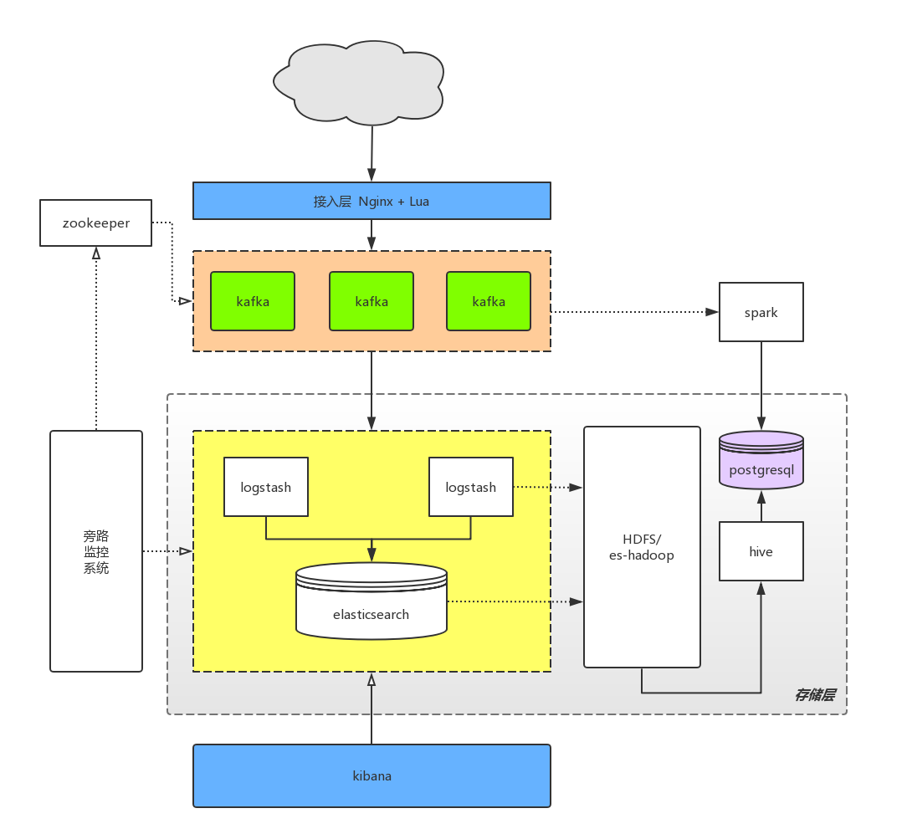
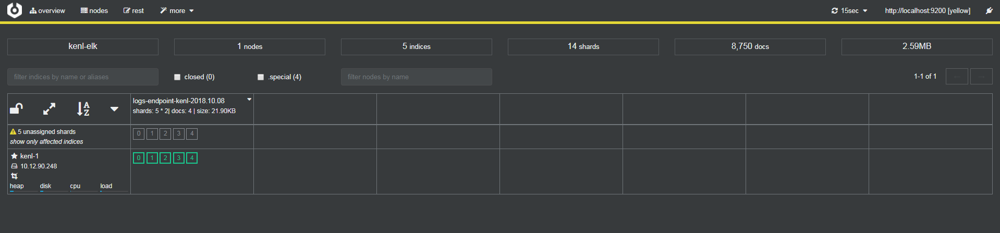
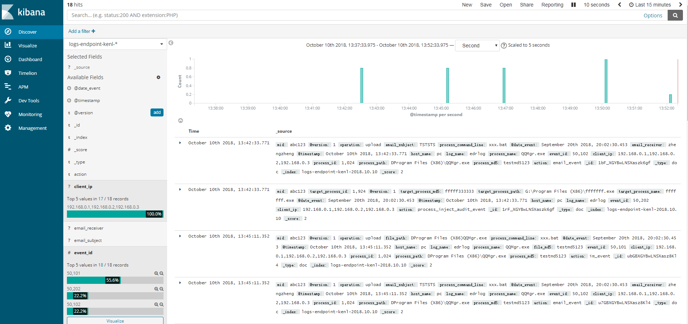
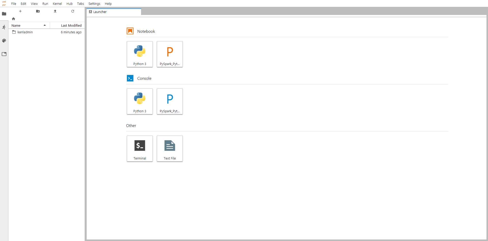

# kenl

dockerized gateway service for data push processing

简单组件架构如下：



## 如何使用

安装依赖环境：
- `docker` 
- `docker-compose`

(可选) 下载构建基本docker镜像

```sh
$ cd bin/ && sh build-images.sh
```

已支持内置的docker组件列表如下：

```sh
cerebro
elasticsearch
jupyter
kafka
kibana
logstash
nginx
postgresql
spark
zookeeper
```

执行安装脚本

```sh
$ cd bin/ && sh kenl.sh install
```


## gateway部署

### 安装openresty
    
安装依赖包  

```sh 
$ yum install -y gcc gcc-c++ readline-devel pcre-devel openssl-devel tcl perl zlib zlib-devel
```  
   
    
安装openresty

```sh
$ tar zxvf ngx_openresty-1.13.6.2.tar.gz    
$ cd ngx_openresty-1.13.6.2

$ ./configure \
   --prefix=/usr/local/openresty \
   --with-cc-opt="-I/usr/local/opt/openssl/include/ -I/usr/local/opt/pcre/include/" \
   --with-ld-opt="-L/usr/local/opt/openssl/lib/ -L/usr/local/opt/pcre/lib/" \
   -j8

$ gmake    
$ gmake install
```


```sh
$ ln -sfnv /usr/local/openresty/nginx/sbin/nginx /usr/local/bin/nginx
```

### 部署gateway

```sh
$ cd bin/ && sh gateway-install.sh
```


## 数据上报：

演示格式：

> 报文格式字段的制定和过滤可以参照 docker/kenl-logstash/pipeline/12-kenl-edr-filter.conf，自己也可以设计自定义的报文格式，放到 docker/kenl-logstash/pipeline/ 下即可

```
{
	"client_ip": ["192.168.0.1", "192.168.0.2", "192.168.0.3"],
	"computer_name": "pc",
	"mid": "abc123",
	"cmds": [{
		"cmd": 50101,
		"time": "2018-09-20 12:02:30.453",
		"data": {
			"ProcessPath": "D:\\Program Files (X86)\\demo.exe",
			"ProcessMd5": "testmd5123",
			"ProcessId": 1024,
			"CommandLine": "xxx.bat",
			"Operation": "upload",
			"FilePath": "D:\\Program Files (X86)\\demo.exe",
			"FileMd5": "testmd5123"
		}
	}]
}
```
演示上报

```sh
curl -XPOST -H 'Content-Type: application/json' 'http://your-gateway:12080/push' -d '{"client_ip":["192.168.0.1","192.168.0.2","192.168.0.3"],"computer_name":"pc","mid":"abc123","cmds":[{"cmd":50101,"time":"2018-09-20 12:02:30.453","data":{"ProcessPath":"D:\\Program Files (X86)\\demo.exe","ProcessMd5":"testmd5123","ProcessId":1024,"CommandLine":"xxx.bat","Operation":"upload","FilePath":"D:\\Program Files (X86)\\demo.exe","FileMd5":"testmd5123"}}]}'
```

## 组件监控

#### es监控dashboard

浏览器访问：http://ip:9000



#### kibana dashboard

浏览器访问：http://ip:24080




#### Jupyter Notebook

浏览器访问：http://ip:8000




### 相关管理命令

- kenl 停止

```sh
$ cd bin/ && sh kenl.sh stop
```

- kenl 启动

```sh
$ cd bin/ && sh kenl.sh start
```

- kenl 重启

```sh
$ cd bin/ && sh kenl.sh restart
```

- kenl 安装

```sh
$ cd bin/ && sh kenl.sh install
```

- kenl 卸载

```
$ cd bin/ && sh kenl.sh clean
```